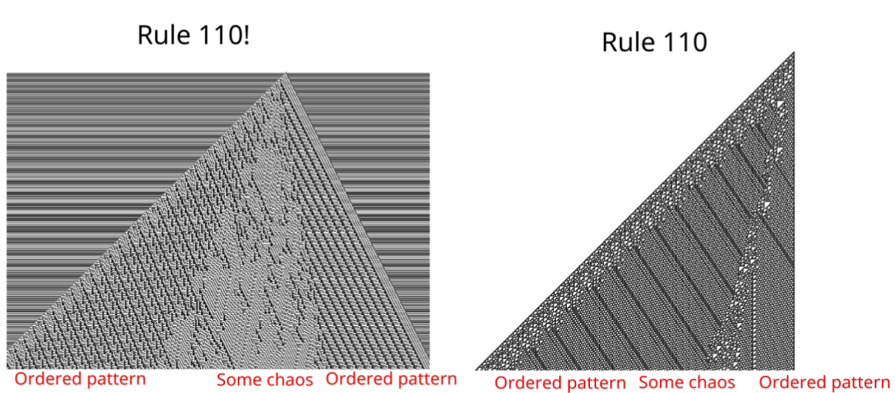

# Dynamic Rule Cellular Automata
The original idea of the experiment was to create a "second-order rule" for cellular automata which would modify the rule on each iteration. The "second-order rule" is represented with a string variable `order2_rule` on line five in the code. If you leave the string empty, you will get a regular elementary cellular automaton.
Such automata are still completely deterministic, yet at times they have a bigger degree of variation and provide more space for dynamics to produce chaos and complexity. However, in many cases, especially when performing binary shifts on the rule, modified automata end up alternating full-black and full-white states after producing various branched patterns.
## Second-order rule notation
In this experiment, the are five basic operations that can be performed on the rule. These include:
```
> - shift bits in the rule to the right
< - shift bits in the rule to the left
+ - add 1 to the rule number
- - subtract 1 from the rule number
| - mirror the binary representation of the rule
! - perform "not" operation on each bit of the rule
```
All of these can be combined in a sequence to form a string in `order2_rule`. For instance:
```julia
order2_rule = ">>+"
```
The above configuration means that on each iteration we will shift the binary representation of the rule by two and add one to what we have got. Of course, the second-order rule sequence of operations is not commutative and `"+>"` is not the same as `">+"`, so the order matters.
Note that `>` and `<` operations are circular, so:
```
01100111
perform '>'
10110011
```
The `"!"` second-order rule has an interesting property of keeping properties of the initial rule. For example, the picture generated with `110!` rule (starting with a dot distribution) is different from simply `110` but properties persist ans the shape is similar. Rules `30!` and `30` (starting with a dot distribution again) even share the property of having a chaotic line that separates the chaotic and ordered patterns. For all tested `"!"` rules, the Wolfram class of the initial automaton persisted.

## Libraries and usage
All the code was originally implemented in Julia v1.4. I have used matplotlib for the graphics through PyPlot and PyCall (you can install those with no problem using Pkg). The code works both in Juno environment displaying graphics in the Plots section and from the terminal via the standard matplotlib view (see the last two lines of code).
### Config
All the configurations to select a specific automaton can be accessed in the first block of code.
## License
The code of the experiment is provided under the MIT license. Please, leave a credit to me (Atell Krasnopolski) and this repository, in case you use this software as a tool for your experiments/research or if you develop or mention any of my ideas presented here (specific implementation of dynamic rule cellular automata, bit shift on rules, etc).
## Examples
40+

60>|<

105>>+

